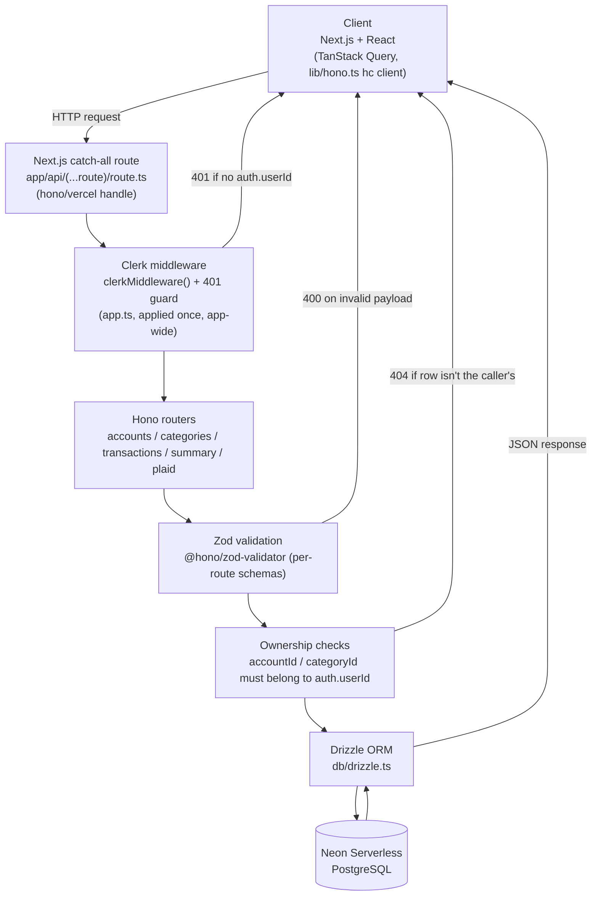
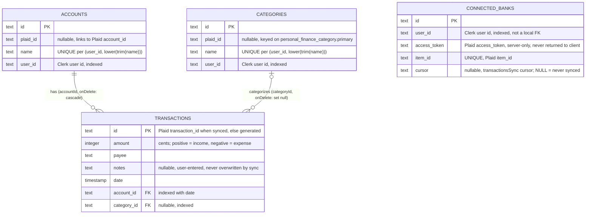
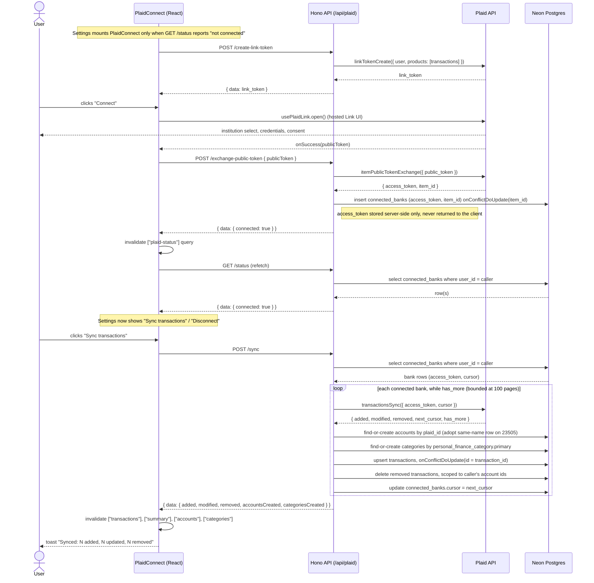
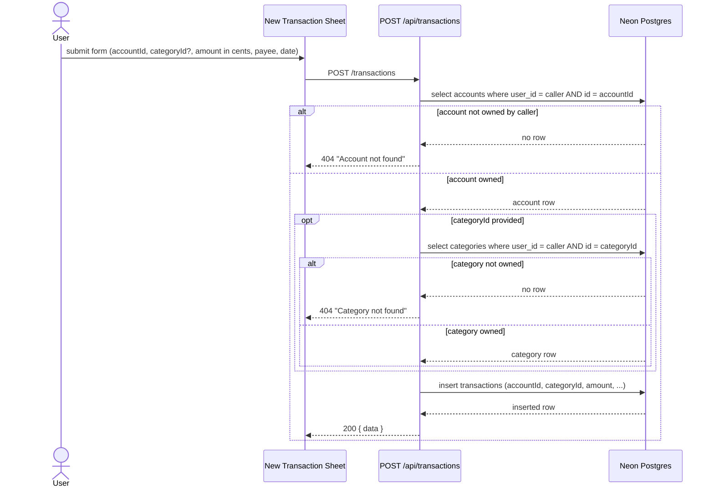

A modern **personal finance management dashboard** built with **Next.js, React, Drizzle ORM, and Neon Serverless Postgres**.

The application allows users to manage financial accounts, upload transactions via CSV, and visualize financial trends through dynamic charts.

Designed with **performance, scalability, and modern full-stack architecture in mind.**

---

  🚀 Live Demo

Deployed on **Vercel**

```
https://financial-dashboard2-omega.vercel.app/
```

---

  ✨ Features

  🔐 Authentication

Secure authentication powered by **Clerk**

* Sign up / Sign in
* Protected routes
* User session management
* Secure API access

---

  🏦 Account Management

Users can:

* Create financial accounts
* Manage multiple accounts
* Track balances per account
* View account transaction history

---

  💳 Transaction Management

Users can:

* Create transactions manually
* Upload transactions via **CSV**
* Filter transactions
* Track income and expenses

Transactions are validated using **Zod schema validation**.

---

  📊 Financial Overview

The dashboard calculates financial data for the **last 30 days**:

* Total **Income**
* Total **Expenses**
* **Remaining Balance**

Each metric is displayed in overview cards with trend indicators.

---

  📈 Data Visualization

Interactive charts built with **Recharts**

   Pie Chart

Shows distribution of income and expenses.

   Bar Chart

Compares income vs expenses.

   Line Chart

Displays financial growth or decline over time.

---

  🏦 Plaid Integration

The project integrates with **Plaid API** to connect financial institutions.

Users can:

* Connect bank accounts
* Import transactions automatically
* Sync financial data

Plaid provides secure bank-level integrations.

More information:
[https://plaid.com](https://plaid.com)

---

  🧭 Application Routes

Main application routes:

```
/auth
/overview
/accounts
/transactions
/categories
/settings
```

   Route Description

| Route           | Description                         |
| --------------- | ----------------------------------- |
| `/overview`     | Dashboard financial summary         |
| `/accounts`     | Manage financial accounts           |
| `/transactions` | Transaction history and CSV uploads |
| `/categories`   | Manage transaction categories       |
| `/settings`     | User settings                       |
| `/auth`         | Authentication routes               |

---

  🧠 Tech Stack

  Frontend

* **Next.js 16**
* **React 19**
* **TypeScript**
* **TailwindCSS**
* **Shadcn UI**
* **Radix UI**

---

  Backend

* **Hono** (API routes)
* **Zod validation**
* **Clerk authentication**

---

  Database

* **Neon Serverless PostgreSQL**
* **Drizzle ORM**
* **Drizzle migrations**

---

  State Management

* **TanStack React Query**
* **Zustand**

---

  Charts & Visualization

* **Recharts**

---

  CSV Processing

* **PapaParse**

---

  Deployment

* **Vercel**
* **Serverless Neon Database**

---

  🏗 Architecture



Authentication is handled once, app-wide, in `app.ts` (`clerkMiddleware()` plus a 401 guard) —
not re-checked per route. Ownership checks (does this `accountId`/`categoryId` actually belong
to the caller?) run inside each handler, after validation and before any write — see
`app/api/[[...route]]/transactions.ts`.

---

  🗄 Database Schema

Four tables, defined in `db/schema.ts`. `accounts` and `categories` both carry a nullable
`plaid_id` (populated only once a Plaid sync creates or matches a row) and a
`UNIQUE (user_id, lower(trim(name)))` index, so a user can't end up with two accounts or
categories that only differ by case or whitespace. `transactions.account_id` cascades on
delete; `transactions.category_id` is set to `null` on delete instead, since deleting a
category shouldn't delete the transactions that used it. `connected_banks` has no foreign key
to the other tables — it's scoped to a user purely by `user_id` (a Clerk user id, not a local
table), and its `access_token` never leaves the server.



---

  🔗 Plaid Connect & Sync Flow

The most complex flow in the app: connecting a bank via Plaid Link, then syncing transactions
with Plaid's cursor-based `transactionsSync` API. The `access_token` Plaid issues is stored
server-side in `connected_banks` and is never sent back to the client.



---

  🔒 Ownership Check Flow (transaction write)

Every write that references an `accountId` or `categoryId` re-verifies the referenced row
actually belongs to the caller before touching the database — this is the fix for BUG-001 /
BUG-002 (an IDOR that let a user attach a transaction to another user's account). Shown here
for `POST /api/transactions`; the same pattern also guards `bulk-create` and `PATCH /:id`.



---
 
  ⚙️ Installation

Clone the repository

```bash
git clone https://github.com/abdulatif90/finance-dashboard.git
```

Move into project

```bash
cd finance-dashboard
```

Install dependencies

```bash
npm install
```

---

  🔐 Environment Variables

Create a `.env` file

```
DATABASE_URL=
NEXT_PUBLIC_CLERK_PUBLISHABLE_KEY=
CLERK_SECRET_KEY=

PLAID_CLIENT_ID=
PLAID_SECRET=
PLAID_ENV=
```

---

  🗄 Database Setup

Generate migrations

```
npm run db:generate
```

Run migrations

```
npm run db:migrate
```

Seed database

```
npm run db:seed
```

Open Drizzle Studio

```
npm run db:studio
```

---

  🧪 Development

Run development server

```
npm run dev
```

Build production

```
npm run build
```

Start production

```
npm run start
```

---

  📊 Example CSV Import

Example transaction CSV format:

```
date,account,category,payee,amount,notes
2026-02-01,Coffee,-5,Food
2026-02-02,Salary,2000,Income
```

---

  🔮 Future Improvements

Potential features:

* Budget planning
* Recurring transaction detection
* AI spending insights
* Mobile PWA version
* Export reports (PDF/CSV)

---

  📜 License

MIT License

---

  👨‍💻 Author

Developed by **Abdulatif**

If you like this project please ⭐ the repository.


